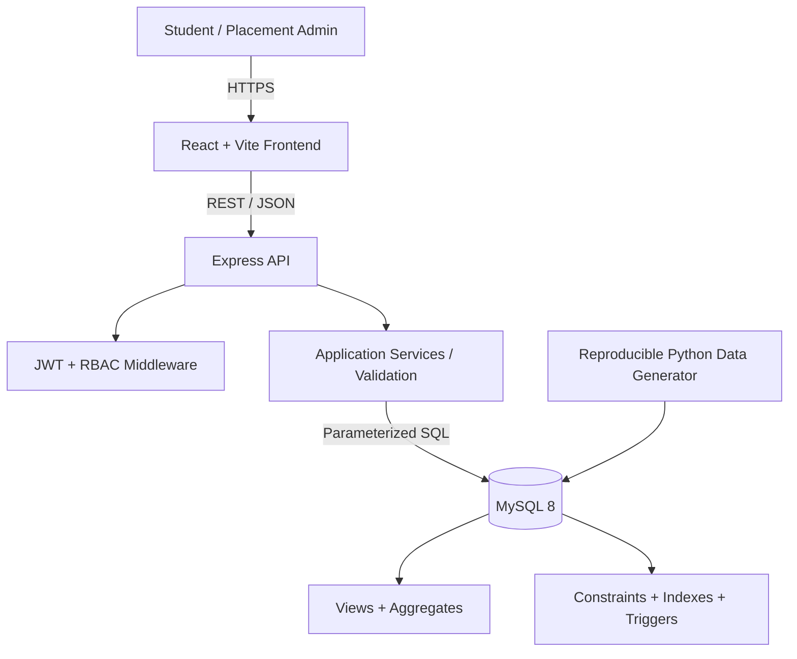

# Architecture

```mermaid
flowchart TD
 U[Student / Placement Admin] -->|HTTPS| F[React + Vite Frontend]
 F -->|REST / JSON| A[Express API]
 A --> AUTH[JWT + RBAC Middleware]
 A --> S[Application Services / Validation]
 S -->|Parameterized SQL| DB[(MySQL 8)]
 DB --> V[Views + Aggregates]
 DB --> C[Constraints + Indexes + Triggers]
 G[Reproducible Python Data Generator] --> DB
```

The browser never connects directly to MySQL. MySQL is the system of record; the frontend consumes only REST endpoints exposed by Express.
