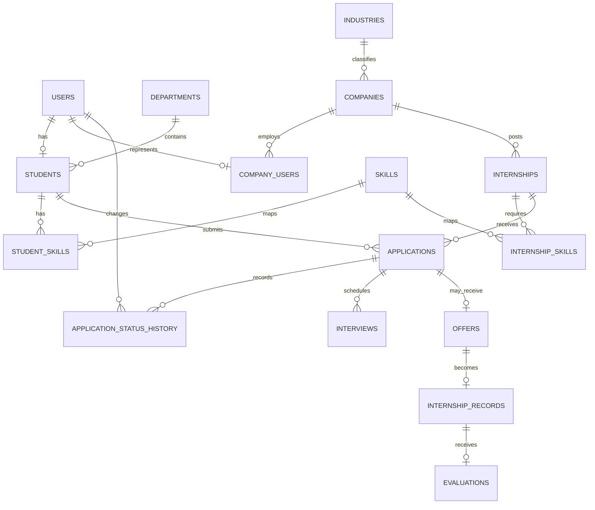

# ER Diagram

`application_status_history` is deliberately separate from `applications`: the current state belongs on the application row for efficient filtering, while transitions are repeating temporal facts and therefore form a 1:N child relation.
